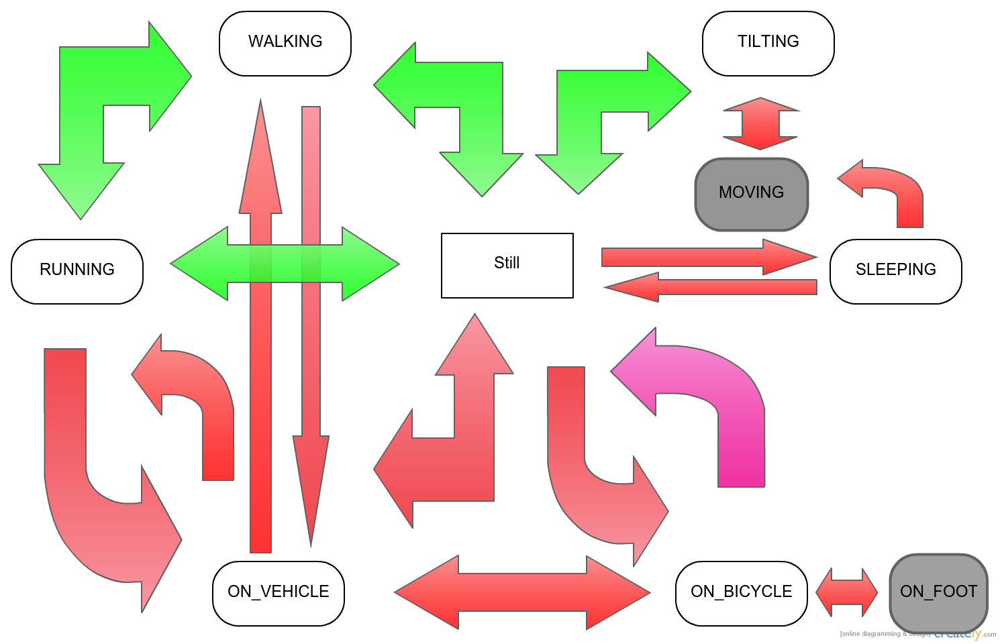

# Noise reduction algorithm version 0.3

## Terminology:

 * Activity: The single act that the user is doing and is reported back as a result by the Google API. This can be correct or incorrect.
 * Context: The situation the activity is performed in consisting of ,but not limited to, location, time of the day, previous activity and sensory input.
 * Noise: A recognized activity which is out of context and we chose to ignore/revert it to another activity which corresponds to our perceived context. 
 * Transition: A **circular** change in the activity recognition sequence meaning a change of current active activity from A to B and then back to A before a certain threshold.
 * illegal transition: A transition from activity A to activity B and back to A which is against our noise reduction policy and will be reverted.
 * legal Transition: A transition from activity A to activity B which honors our policy therefore will be kept.
 * Threshold: Maximum time in seconds that an activity change is called a Transition. After that it is just a state change and does not concern us.

## Problem description

Google API is an out of context activity recognition engine meaning that the output is by no means relevant to what was previously happening or the situation the user did that certain activity. In the context of continuous and 24/7 activity recognition and reporting we come across a huge number of detected activities that fall within one of these categories:

1. UNKNOWN activity: meaning the sensory input was not enough for the api to differentiate what was exactly being done in that moment.
2. False activity: meaning that the detection is totally incorrect.
3. Relatively false activity: meaning that although that activity is being performed, there is another activity which we chose to prioritize over this one. For example if the user is walking inside a train while the train is moving can result in a WALKING activity instead of IN_VEHICLE which we may want to log.

All these three items together prove to cause a fairly large amount of noise in the sample data we gathered and therefore make it hard to provide useful reports.

## Proposed solution

Our proposed solution attacks the problem in two different vectors:

### Monitoring state transitions

There is always a large number of recognized instances that are single incidents in a continuous run of correct recognitions. By introducing and legalizing the state transitions from activities to each other we try to detect when an illegal transition occurs and log the correct activity instead.

** Note: In this diagram red transitions are illegal and green ones are allowed. ** 

### Introducing context

*[TBD]* There are numerous ways of introducing context to the application using light and audio sensory input, location detection and history management, time of the day and the users interaction with the device. Afterwards the verified context can aid in validating both states and state transitions. For example a user will not start RUNNING right after he was SLEEPING and then continue to SLEEP again afterwards before the threshold passes; but since SLEEPING is not a sensory recognizable activity but a contextually deducible one, we need to introduce context detection and verification first.

### TODO
1. Dynamic threshold based on Context
2. Specific thresholds for each transition instead of a global threshold for all transitions.
3. Multi-level transitions management. I.e from RUNNING to WALKING to STILL and back to RUNNING all before the threshold.
